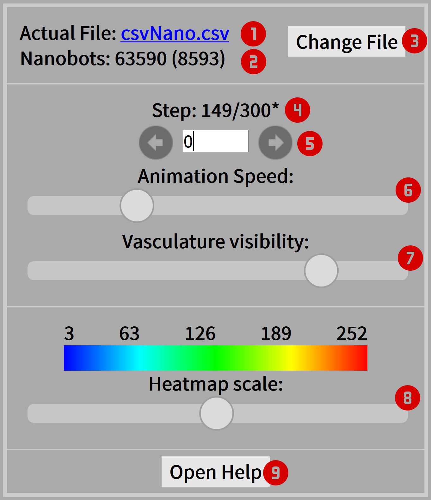
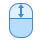

= BVS-Vis: A Web-Based Visualizer for BVS

Regine Wendt <wendt@itm.uni-luebeck.de> and Chris Deter
v1.1, 2019-04-24

== Introduction

BVS is a ns-3 module that simulates the global movement of objects in the human body. It’s main purpose is to model the work environment of medical nanobots.
For a detailed introduction to BVS see: https://github.com/RegineWendt/blood-voyager-s

In this repository you find BloodVoyagerS Visualizer (BVS-Vis) and a complete docker-compose setup to run both BVS and BVS-Vis.
BVS-Vis is a web-based visualizer for BVS result files. It can process a 'csvNano.csv' file and visualizes every simulation step in a three-dimensional model. It is possible to zoom in that model or to move it while the simulation is running. The simulation runs automatically or step by step. It is also possible to jump to a specific timestep. There is an option to upload different 'csvNano.csv' files. BVS-Vis streams input files and therefore can handle large files and supports compressed files as well. The jump function is limited in large streamed files. A python script to compress a 'csvNano.csv' file is included. If a compressed file is loaded a heatmap with the actual nanobot concentration gets displayed.

== Start Web Visualization
BVS-Vis can be used (by opening *link:visualizer/index.html[index.html]*) in any browser that supports WebGL.

A webserver is recommended to run this visualizer. When using a webserver, it is possible to set a default file by putting a 'csvNano.csv' file in a folder called 'csv' inside the folder where the index.html is located. It will be automatically loaded on opening the visualizer.

It is possible to execute the python script to compress a 'csvNano.csv' file. It has an optional parameter that defines the number of decimal places that are displayed in the visualizer. By default, this is 1 which corresponds to an accuracy of 1mm.

== Getting Started with NS-3 and Docker
It can be tricky to get ns-3 running. If any problems are encountered  (especially with windows) it is possible to use a docker container.

=== Install Docker/Docker-Compose

* https://docs.docker.com/install/
* https://docs.docker.com/compose/install/

=== Starting NS-3 & Web Visualization with Docker-Compose
The root directory includes a docker compose file which consists of two components. The first component is the NS-3 Docker container including the BVS module. The second component contains BVS-Vis.

A config file with runtime parameters is required for the simulation. By default, the config file is called `config-blood-voyager.env` and contains the following configuration:

[source,bash]
----
# IMPORTANT! no spaces between '=' and value
# simulation duration in seconds
SIMDURATION=95
# number of nanobots
NUMOFNANOBOTS=305
# injection vessel [1-94]
INJECTVESSEL=62
# compression on:1 | off:0
COMPRESSION=1
# number of comma places in compressed file (default: 1)
ACCURACY=1
----

1. __[Optional]__ If you haven't build the image yet or the source has changed, it is necessary to (re-)build the docker image: `docker-compose build`.
2. The BVS simulation parameters inside `config-blood-voyager.env` must be configured or  a custom file in the docker-compose file has to be defined.
3. Docker-compose should be running on the local machine.
4. The simulation can be started with `docker-compose up ns3`.
5. The BVS module will run and stop after the simulation is completed.
6. The visualization can be started with `docker-compose up visualizer`.
7. After opening http://localhost:8080 it is possible to see visualized results.
8. The visualization can be stopped with `docker-compose down`.

=== Starting NS-3 & Web Visualization with Docker
Here are commands to start BVS-Vis (without docker-compose):

1. Building the docker image: `docker build -t bloodvoyagers --build-arg NS3VERSION=3.29 .`
2. Execute the docker image. There are two options to specify the necessary enviroment variables with the `run` command.
** It is necessary to specify a .env file. For Example, `config-blood-voyager.env`: +
`docker run -d --rm --env-file="config-blood-voyager.env" -v /path/to/output/:/var/www bloodvoyagers`
** Alternatively, all necessary environment variables need to be specified: +
`docker run -d --rm -e SIMDURATION=95 -e NUMOFNANOBOTS=305 -e INJECTVESSEL=62 -e COMPRESSION=1 -e ACCURACY=1 -v /path/to/output/:/var/www bloodvoyagers`
3. Run the visualizer: +
`docker run -d --rm -p 80:80 -v $(pwd)/visualizer:/usr/share/nginx/html nginx:latest`

== Using the Web Visualization
BVS-Vis has a control panel in the upper left corner which looks like the following image:

1. See and download the actual source file (if available).
2. See the actual number of nanobots in the animation.
3. Upload custom BVS data file.
4. See the actual step and the available steps. `*` Indicates that more data is loaded at the moment.
5. Step manually or type a specific step.
6. Change the animation speed. Pull the slider to the left to stop the animation completely
7. Change visibility of vasculature.
8. Change heatmap scale. This part is only visible if the input file is compressed. Change the heatmap scale slider to the left, to disable the heatmap.
9. Access the documentation and get information about the animation control via mouse.

It is possible to control the animation with the following keys:

[frame="none",grid=none,cols="15%,80%"]
|====
|image:Images/left-click.png[left click]| to rotate body around its own axis
||  zoom into animation
| | to move body around
|====
